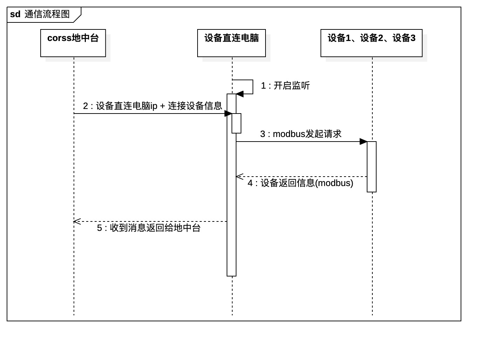

### 工作内容：

#### daily：

1.更新一下规格 -- 增加socket通信逻辑

码一下很好看的图 

2.整理一下调测方案，继续开发代码（不能因为下周调测开发就懈怠呀！）


#### iOS：


### 经验总结：


在本地调测中，因为是mac m2芯片 装ruby遇到很大阻碍

rvm命令：

```bash
rvm list								 # 查看本地ruby所有版本
rvm list known					 # 查看所有可以升级的ruby版本 mac升级还是建议参考链接中的
rvm defalut [ruby版本]		# 切换ruby默认版本
```

参考链接🔗：https://blog.csdn.net/poena/article/details/124742251
